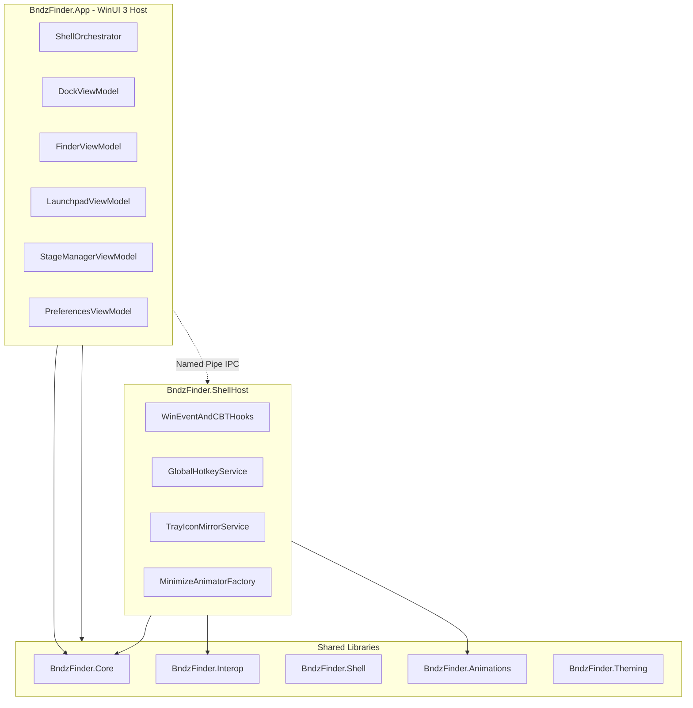

# Bndz-Finder Architecture

## Process Model



## Projects

| Project | Responsibility |
|---------|----------------|
| `BndzFinder.App` | WinUI 3 host, single-instance, launches dock + finder windows |
| `BndzFinder.Dock` | MyDock ViewModel, fisheye layout, folder stacks, weather, progress |
| `BndzFinder.Finder` | MyFinder menu bar, system widgets, tray proxy |
| `BndzFinder.Launchpad` | App grid, search, catalog providers |
| `BndzFinder.StageManager` | Window thumbnail strip |
| `BndzFinder.Preferences` | Settings UI (10 sections), localization |
| `BndzFinder.ShellHost` | Global hooks, hotkeys, tray mirror (Dockmod equivalent) |
| `BndzFinder.Core` | Settings JSON schema, IPC, orchestration, backup |
| `BndzFinder.Interop` | CsWin32 AppBar, hooks, tray toolbar |
| `BndzFinder.Shell` | Mac-style icon pipeline, badge adapters |
| `BndzFinder.Animations` | Genie/Scale/Suck/ScaleDX minimize engine |
| `BndzFinder.Theming` | Theme pack import/export |

## IPC Contract

Transport: named pipe `BndzFinder.ShellHost` with length-prefixed JSON frames.

| Message | Direction | Purpose |
|---------|-----------|---------|
| `Ping` / `Pong` | bidirectional | Health check |
| `MinimizeRequested` | App → ShellHost | Intercept minimize, start animation |
| `MinimizeCompleted` | ShellHost → App | Animation finished |
| `RestoreRequested` | App → ShellHost | Reverse animation |
| `TrayIconsUpdated` | ShellHost → App | Tray mirror refresh |
| `HotkeyPressed` | ShellHost → App | Global hotkey fired |
| `WindowListUpdated` | ShellHost → App | Stage Manager refresh |
| `Shutdown` | App → ShellHost | Clean exit |

## Settings

- Path: `%APPDATA%\BndzFinder\settings.json`
- Atomic save via temp file + replace
- Schema maps MyDockFinder INI keys for parity verification
- Component reset: `dock`, `finder`, `launchpad`, `stagemanager`, `theme`, `all`

## Build Requirements

- **Windows 11 x64** required for full WinUI 3 build
- **.NET 10 SDK**
- Cross-platform libraries (`Core`, `Shell`, `Animations`, `Theming`, `ShellHost`) build on Linux/macOS for CI validation
- WinUI projects require Windows App SDK 1.6+

## Build Commands

```powershell
# Full build (Windows only)
dotnet build BndzFinder\BndzFinder.sln -c Release

# Cross-platform libraries + tests (Linux CI)
dotnet build BndzFinder\src\BndzFinder.Core\BndzFinder.Core.csproj
dotnet test BndzFinder\tests\BndzFinder.Core.Tests\BndzFinder.Core.Tests.csproj
```
